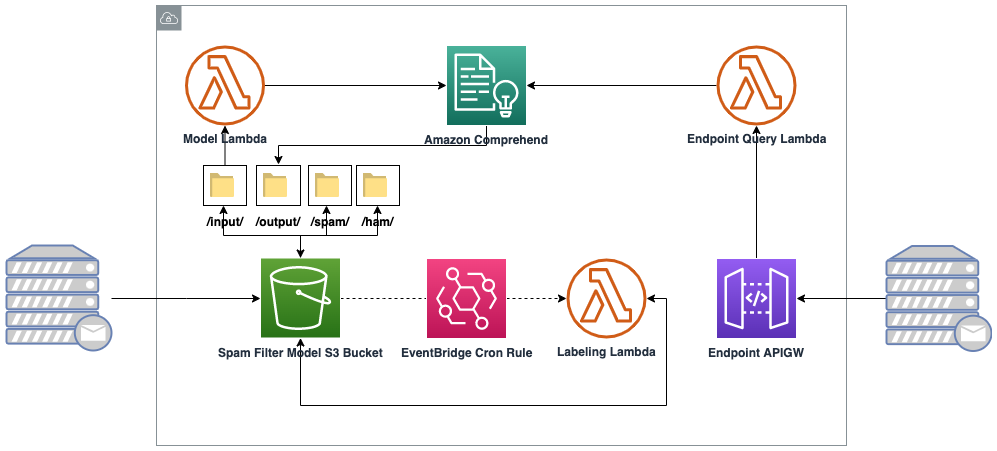

# aws-comprehend-spam-automation-apigw

This repo provides resources for wrapping (a manually created model due to limitation with Terraform) an Amazon Comprehend AI/ML document classification model based on the open-source Enron email dataset. Surrounding infrastructure will be created to allow you to dynamically query text to determine if a particular email is potentially spam or not via an API GW.

This repository is for educational/example purposes only and should be vetted before use in any production environment. 

# How it works

1. A centralized (email) server uploads manually reported SPAM emails and a subset of benign emails to a relative path in an S3 bucket.
2. Event based triggers will:
    1. Start a labeling job at the end of the day with the newly uploaded training material and place it an an OUTPUT folder.
    2. Start a classification job on the newly labeled data.
3. Once available, the model will be queryable via an API GW to dynamically return a confidence score on a given email payload.
